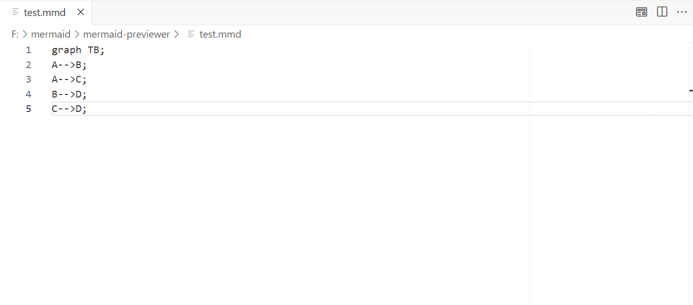

  <h1>Mermaid Editor Pro</h1>
  
The ultimate visual editor for Mermaid diagrams, built right into your favorite IDE.

--- 

## 🌟 Why Mermaid Editor Pro? 

Stop memorizing complex Mermaid syntax. Mermaid Editor Pro bridges the gap between code and design, allowing you to visually click, style, and export diagrams while keeping your source code perfectly synchronized. 

## 🚀 Key Features 

- **Visual Styling:** Click any node to change background and border colors instantly. 
- **Real-time Sync:** Your visual changes are automatically converted back to Mermaid code. 
- **Pro Export:** Export diagrams to high-resolution transparent PNG, SVG, or PDF. 
- **Offline First:** 100% local rendering. We don't upload your code anywhere. 

## 💻 Supported Platforms 

We bring the visual editing experience to where you work: 

### [Visual Studio Code](./platforms/vscode/README.md) 
Available now on the VS Code Marketplace. 
 

### [JetBrains IDEs (IntelliJ, WebStorm, etc.)](./platforms/idea/README.md) 
*Currently Under Review on JetBrains Marketplace.* 
 

### [Figma](./platforms/figma/README.md) 
*Design your diagrams directly in Figma.* 
 

## 💳 Pricing 

Mermaid Editor Pro operates on a **Freemium** model. 
- **Free:** View diagrams, switch themes, and basic SVG export. 
- **Pro ($5/month or $50/year):** Unlocks visual node editing, PDF export, and high-res PNG export. 

*Purchases are handled securely via Paddle or JetBrains Marketplace.* 

## ⚖️ Legal & Policies 

To ensure compliance and protect your rights, please review our policies hosted on our site: 
- [End User License Agreement (EULA)](./LICENSE-EULA.md) 
- [Privacy Policy](https://haizy-labs.github.io/privacy.html) 
- [Refund Policy](https://haizy-labs.github.io/refund.html) 

--- 
*© 2026 Haizy Labs. All rights reserved.* 