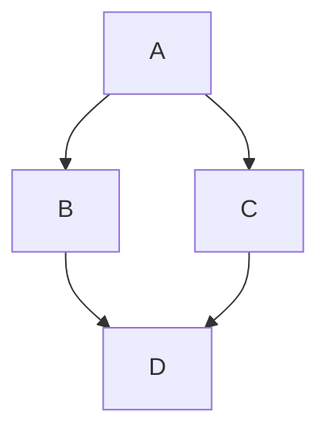

# Mermaid Pro: Visual Editor & Previewer

A powerful extension for VS Code that not only previews Mermaid diagrams but allows you to **visually edit them**! Say goodbye to memorizing complex style syntaxes.

  

## ✨ Features

- **👀 Real-time Preview**: Instantly view your Mermaid charts (`.mmd` or Markdown) with pan & zoom support.
- **🎨 Visual Node Editor**: Click on any node in the flowchart to visually pick background and border colors. The extension will automatically write the correct `style` syntax back to your source code!
- **🔄 Direction Toggles**: One-click buttons to change the layout direction (Top-Bottom, Left-Right, etc.) without touching the code.
- **🌗 Theme Switcher**: Instantly switch between Mermaid's built-in themes (Default, Dark, Forest, Neutral, Base).
- **💾 High-Quality Export**: 
  - **SVG**: Export perfectly cropped vector graphics.
  - **JPG**: Export 3x high-resolution images with automatic padding and perfect centering.

## 🚀 How to use

1. Open any `.mmd` or `.mermaid` file.
2. Click the **Preview Diagram** button in the editor title menu (or right-click -> Preview).
3. **To Edit Colors**: Simply click on any node in the preview! A color picker panel will slide out. Pick your colors and hit "Apply".
4. **To Export**: Use the floating buttons in the bottom-left corner of the preview.

## 📝 Example

Try it with this simple flowchart code to test the visual editing:

## 🛠️ Requirements

- VS Code 1.80.0 or higher.

## Acknowledgements & Copyright

This extension relies on the powerful open-source library **[Mermaid.js](https://mermaid.js.org/)**. 

- Mermaid is licensed under the [MIT License](https://github.com/mermaid-js/mermaid/blob/develop/LICENSE).
- This extension uses Mermaid.js for rendering diagrams. Mermaid.js is created by Knut Sveidqvist and contributors, and is used under the terms of the MIT License. All rights to Mermaid.js remain with its original authors.
- This extension does not claim any ownership over Mermaid or its associated intellectual property.
- For more information about Mermaid, visit https://mermaid.js.org/.

